# MySawit-AUTH

## Database Schema
https://app.eraser.io/workspace/UIuTCmf4r8F0oQXKQoRi

## Api Doc
https://docs.google.com/document/d/10HpIqgPsum000fG7jnK9GIEm32EbXZiKK6fvPFwZXpU/edit?usp=sharing

    
<h2>Monitoring</h2>

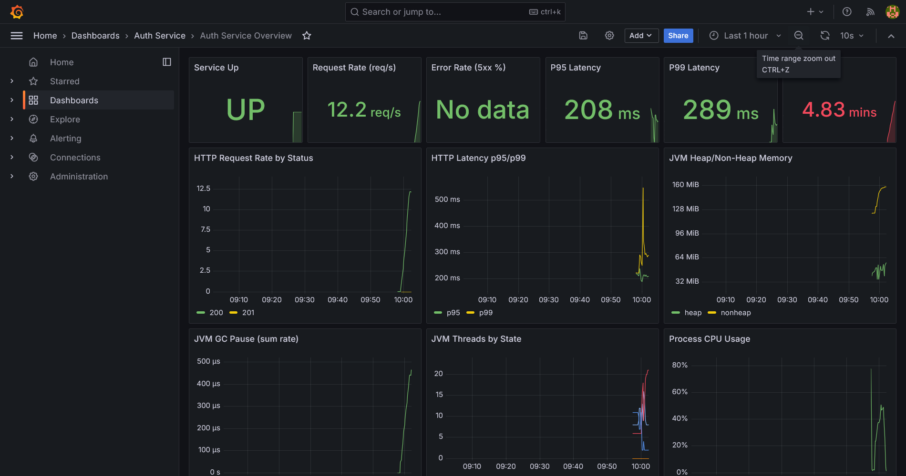
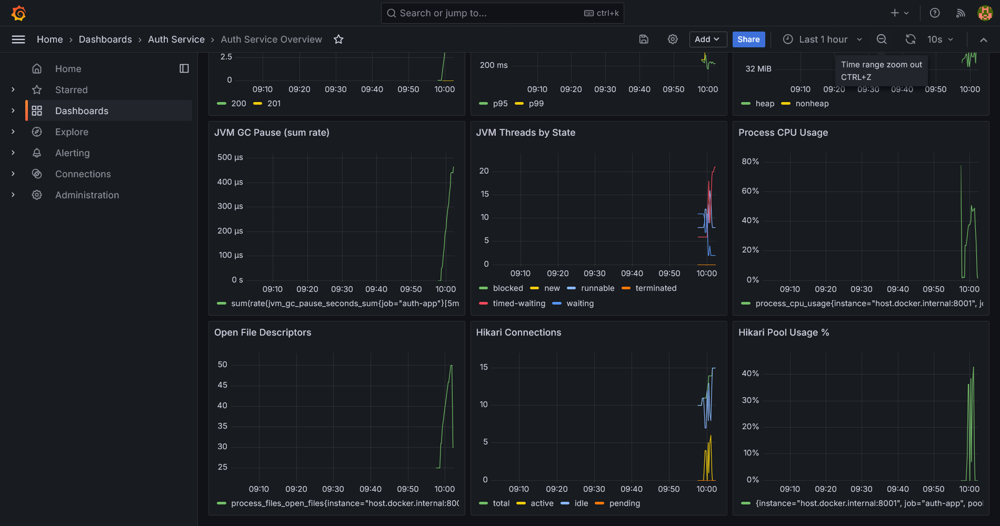

Monitoring pada service ini dilakukan dengan stack berikut:

1. **Prometheus** untuk scrape metrik aplikasi (`job="auth-app"`) dari endpoint actuator/micrometer.
2. **Grafana** untuk visualisasi metrik operasional lewat dashboard **Auth Service Overview** (`monitoring/grafana/dashboards/auth-overview.json`).

Metrik yang dimonitor pada dashboard:

- **Service health & traffic**
  - Service Up
  - Request Rate (req/s)
  - Error Rate (5xx %)
  - Uptime
  - HTTP Request Rate by Status

- **Latency**
  - P95 Latency
  - P99 Latency
  - HTTP Latency p95/p99

- **JVM & process**
  - JVM Heap/Non-Heap Memory
  - JVM GC Pause (sum rate)
  - JVM Threads by State
  - Process CPU Usage
  - Open File Descriptors

- **Database connection pool (HikariCP)**
  - Hikari Connections (total, active, idle, pending)
  - Hikari Pool Usage %

Justifikasi kenapa metrik tersebut harus dimonitor:

- **Service health & traffic**
  - Untuk memastikan service benar-benar available (`Service Up`, `Uptime`).
  - Untuk melihat beban request real-time dan mendeteksi lonjakan trafik (`Request Rate`, `HTTP Request Rate by Status`).
  - Untuk mendeteksi indikasi gangguan secepat mungkin melalui kenaikan error 5xx (`Error Rate`).

- **Latency**
  - Untuk memastikan waktu respons tetap memenuhi target SLA/SLO.
  - P95/P99 dipakai karena lebih representatif terhadap pengalaman mayoritas user dibanding rata-rata, sekaligus menangkap kasus tail latency.

- **JVM & process**
  - Untuk mendeteksi pressure resource aplikasi Java (memori, GC, thread) sebelum berdampak ke timeout/error.
  - Untuk melihat bottleneck di level proses OS (CPU usage dan open file descriptors) yang bisa menyebabkan degradasi performa atau crash.

- **Database connection pool (HikariCP)**
  - Karena hampir semua operasi auth bergantung pada DB, exhaustion connection pool akan langsung menaikkan latency dan error.
  - Metrik active/idle/pending dan pool usage membantu menentukan apakah ukuran pool sudah tepat atau perlu tuning.

    
<h2>Profilling</h2>

Profiling performa pada service ini dilakukan dengan urutan: **load test -> rekam JFR saat loadTest di dalam docker -> Ambil hasil JFR -> analisis hasil**.

### Environment

| Komponen | Konfigurasi |
|---|---|
| App Runtime | Docker container `auth-app` (Spring Boot Java 21) |
| Resource App | `1 vCPU`, `1 GiB RAM` (`cpus: "1.0"`, `mem_limit: 1024m`) |
| Prometheus | `0.5 vCPU`, `512 MiB` |
| Grafana | `0.5 vCPU`, `512 MiB` |
| Total Stack Lokal | Setara `t2.small` (`2 vCPU`, `2 GiB RAM`) |
| Database | PostgreSQL Neon (`ap-southeast-1`, SSL) |
| Data Uji DB | `5000` users dan `2000` assignment aktif buruh-mandor |
| Load Test Tool | `k6` (single-scenario dan concurrent-scenario scripts pada folder `k6/`) |
| Profiling Tool | Java Flight Recorder (JFR) via `jcmd` di dalam container |

Untuk profilling sendiri saya membagi menjadi beberapa flow

### 1.Auth flow (user register, login, get profile)

| Detail User Concurrent | User |
|---|---|
| Single scenario (`k6/auth-loadtest-single.js`) | hingga `20 VU` |

Dari hasil load test, dapat dilihat bahwa latency sangat tinggi (p(95) > 5s)
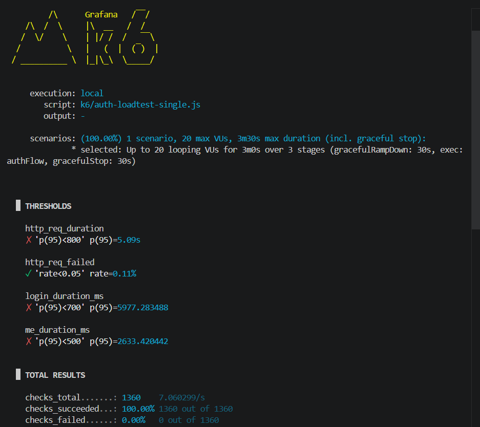

Karena itu disini saya coba lakukan profilling untuk cek bagian kode mana yang menyebabkan hal tersebut
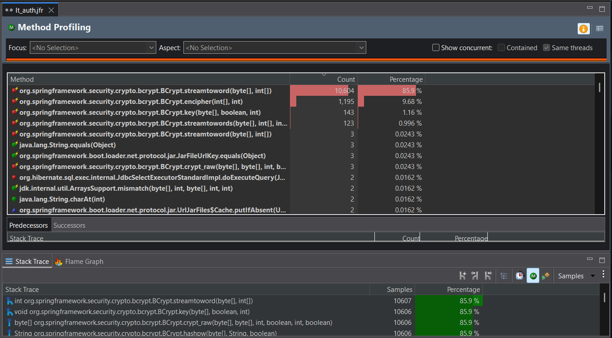
Dan dapat dilihat bahwa penggunaan bcyrpt memakan resource CPU paling banyak, Ini terjadi karena disini saya menggunakan bcyrpt dengan strenght 12 yang dimana hal ini akan sangat berat dan dapat menyebabkan bootlenect ketika dilakukan pada server yang hanya punya 1cpu saja
Karena itu disini saya ubah menjadi 10 saja untuk menyeimbangkan antara performa dengan keamanan
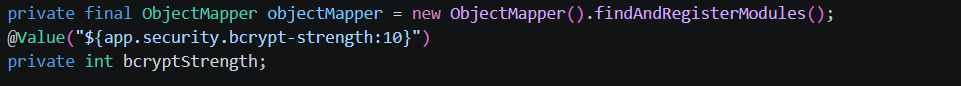

Lalu ketika menjalankan loadtest
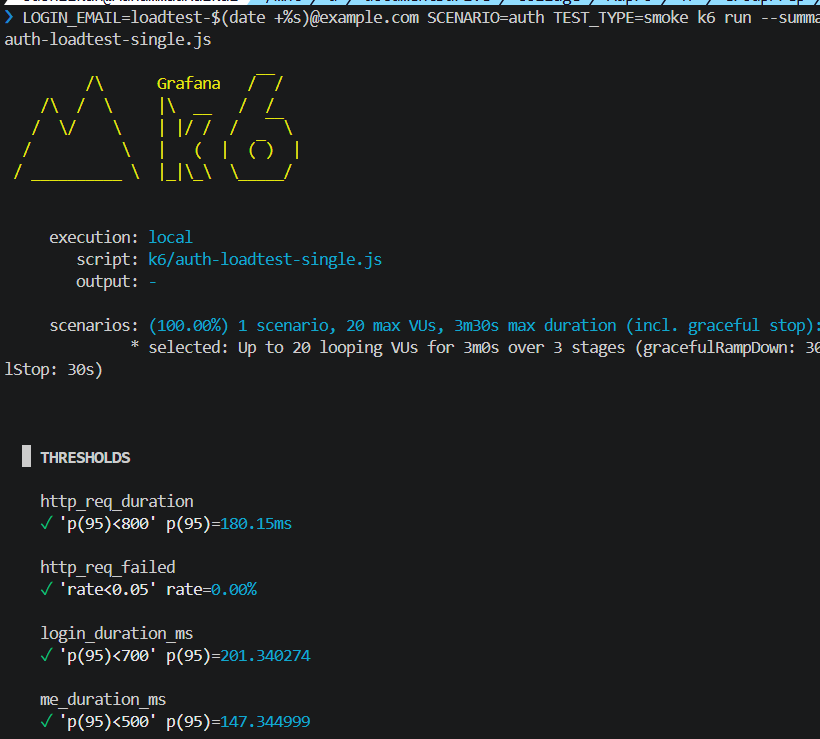
Dapat dilihat bahwa latency pada server sudah aman dan server tidak terjadi bootlenect

### 2.UserManagemet(Get user)

| Detail User Concurrent | User |
|---|---|
| Single scenario (`k6/auth-loadtest-single.js`) | hingga `20 VU` |

Dari hasil load test
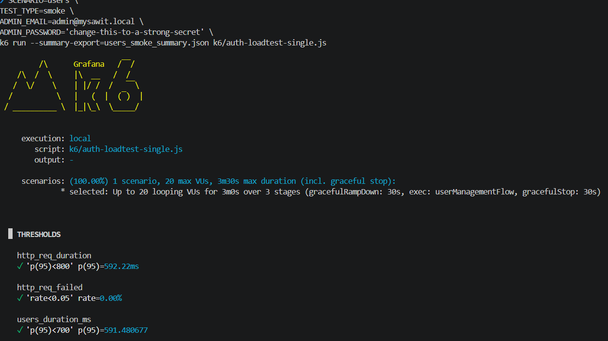
Dapat dilihat bahwa latency sudah baik dan aman

Dara JFR sendiri
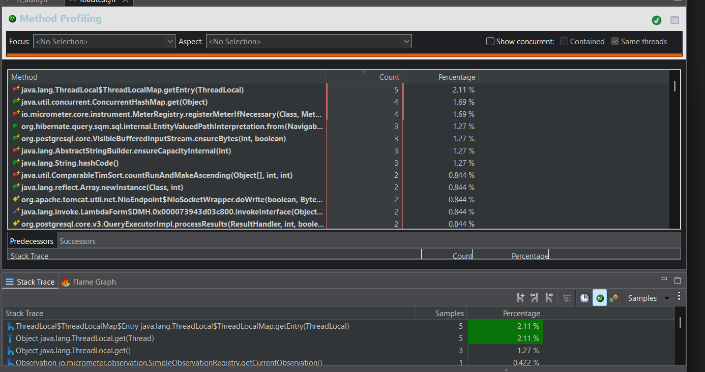

Penggunaan CPU maupun memory tidak ada masalah, Thread sendiri tidak terdapat blocking yang signifikan sehingga dapat dikatakan bahwa kode dari userManagement sudah aman, Ini terjadi karena dari awal saya memang sudah menerapkan pagination pada saat Get users.

### 3.Assignment

| Detail User Concurrent | Nilai |
|---|---|
| Single scenario (`k6/auth-loadtest-single.js`) | hingga `20 VU` |

Dari hasil load test
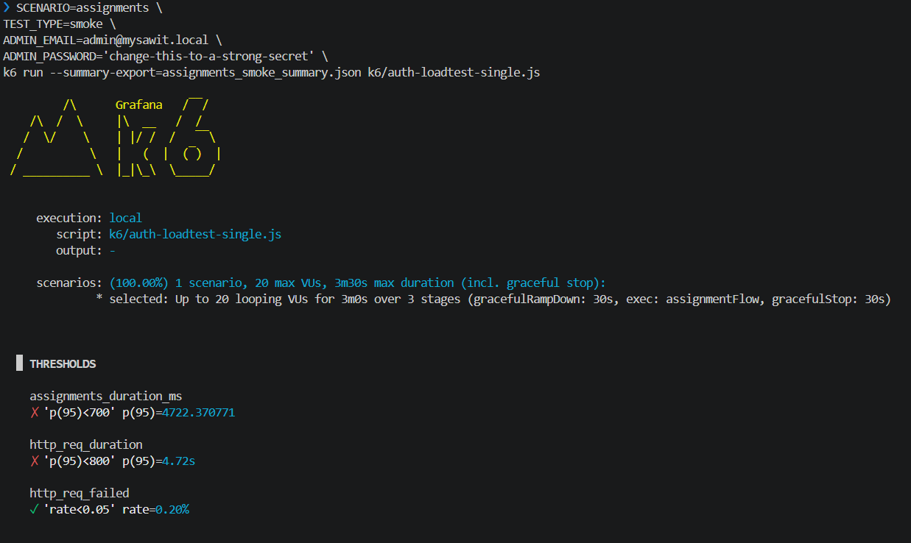
Dapat dilihat bahwa latency cukup tinggi

Karena itu disini saya coba lakukan profilling untuk cek bagian kode mana yang menyebabkan hal tersebut
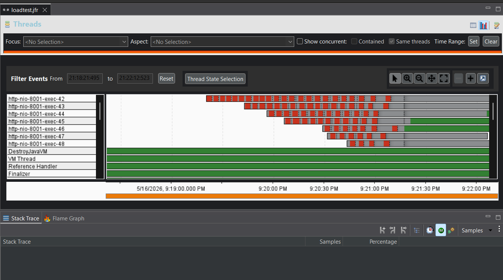
Dan dapat dilihat bahwa terdapat blocking yang cukup signifikan pada hikari pool

Dari dashboard grafana juga menunjukkan hal tersebut
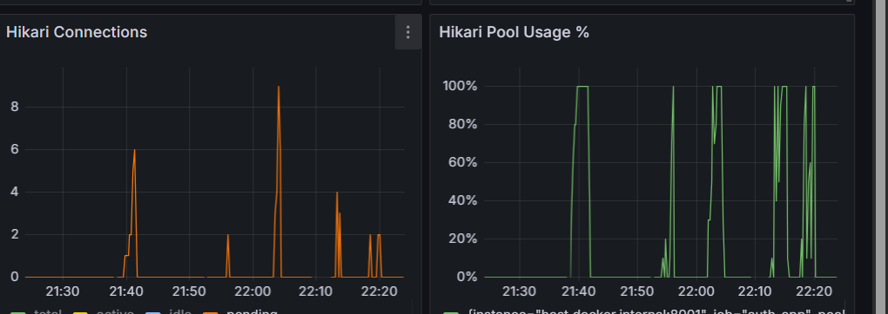
Dimana DB pool connection banyak mengalami pending, hikari pool usage juga sering mencapai 100%. Ini berarti tanda yang jelas bahwa db pool tersaturasi 
Selanjutnya adalah cek kueri mana yang menyebabkan hal tersebut
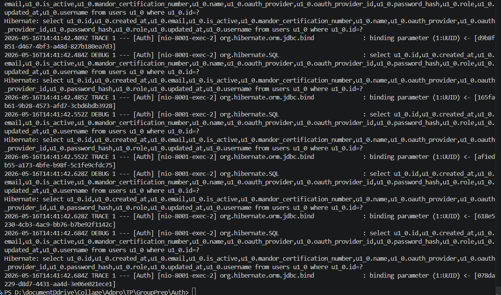
Dapat dilihat pada log docker, terlihat bahwa kueri untuk get assignment mengalami N+1 problem sehingga menyebabkan eksekusi kueri menjadi lambat dan menyebabkan terjadinya pending pada db pool connection

Untuk memperbaiki hal tersebut, disini saya ubah agar kueri get assignment langusng fetch buruh dan mandor dalam satu kali query (JOIN FETCH / @EntityGraph).
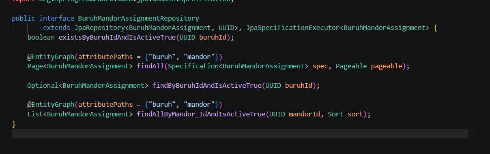
Lalu ubah konfigurasi db pool connection agar fix ke 20
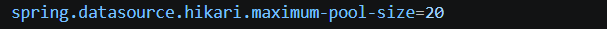

Lalu lakukan loadtest 
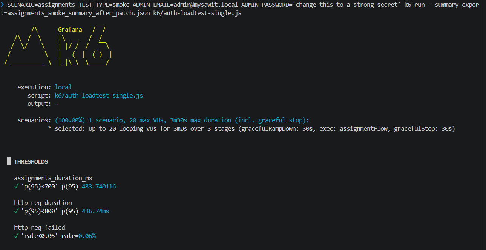
Dapat dilihat bahwa latency sudah aman
Hasil dari JFR pun 
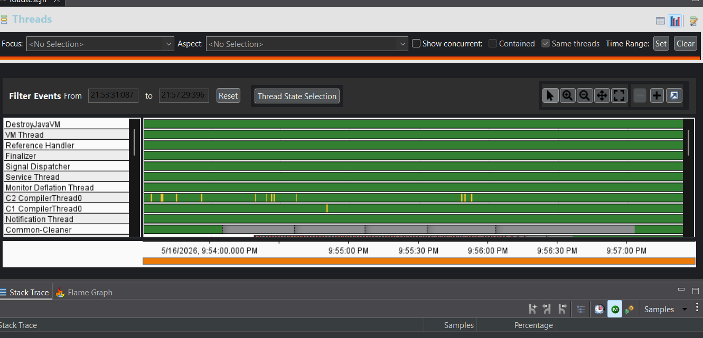
Tidak ada lagi blocking pada theread hikari pool

### Concurent all scenario

| Flow |  Default User (VU) |
|---|---|
| Auth flow | `20` |
| User management flow | `20` |
| Assignment flow |  `20` |
| **Total concurrent user (peak)** |  **`60 VU`** |

Hasil load test dan profilling
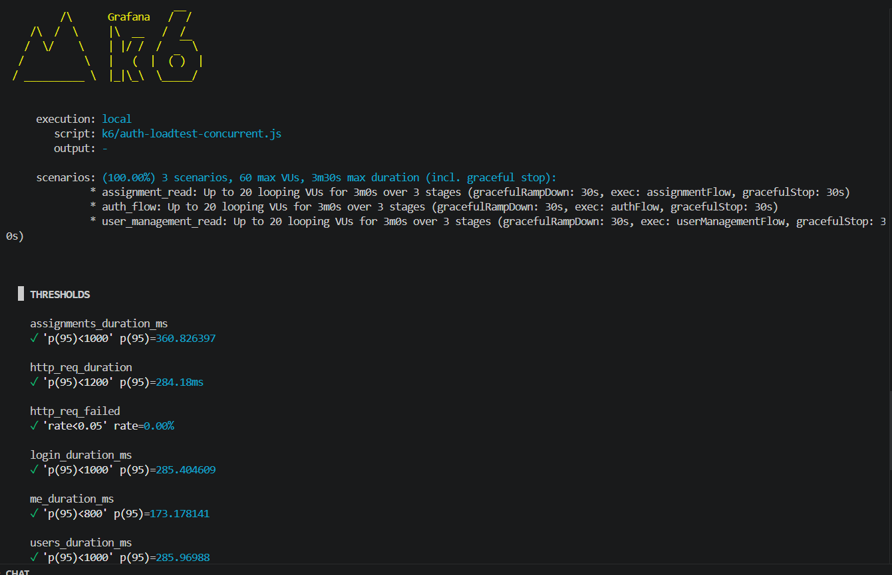
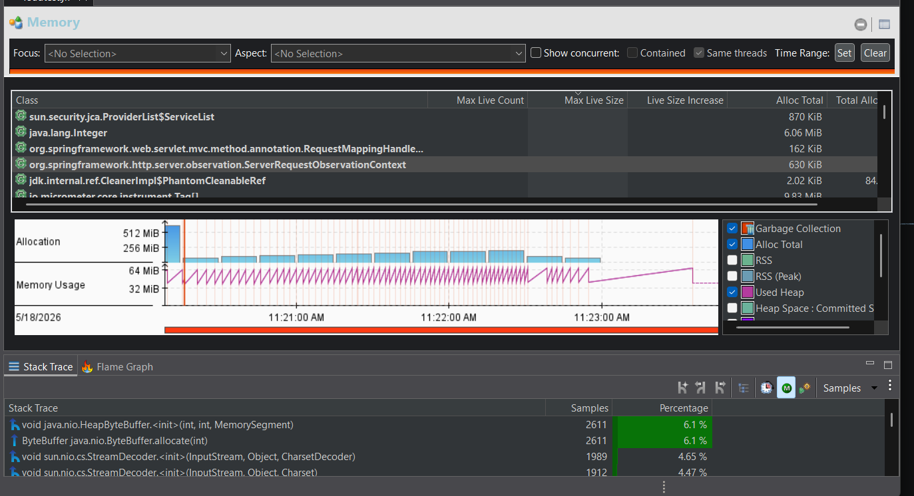
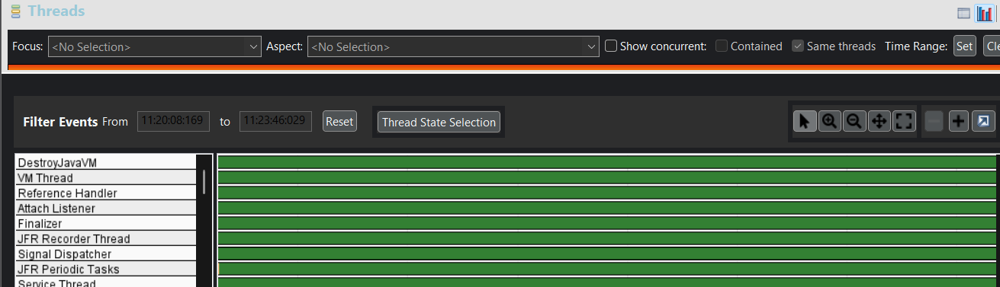
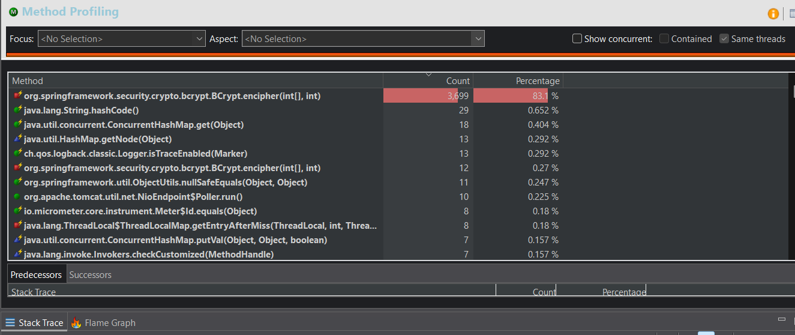

Dapat dilihat bahwa kode sudah aman, bycrpt memang memakan penggunaan CPU yang tinggi namun selama tidak menyebabkan bootlenect pada CPU maka aman

---

    
<h2>Diagrams</h2>

Berikut adalah Component Diagram dan Code Diagrams untuk bagian autentikasi dan manajemen pengguna (MySawit-AUTH) 

### Component Diagram

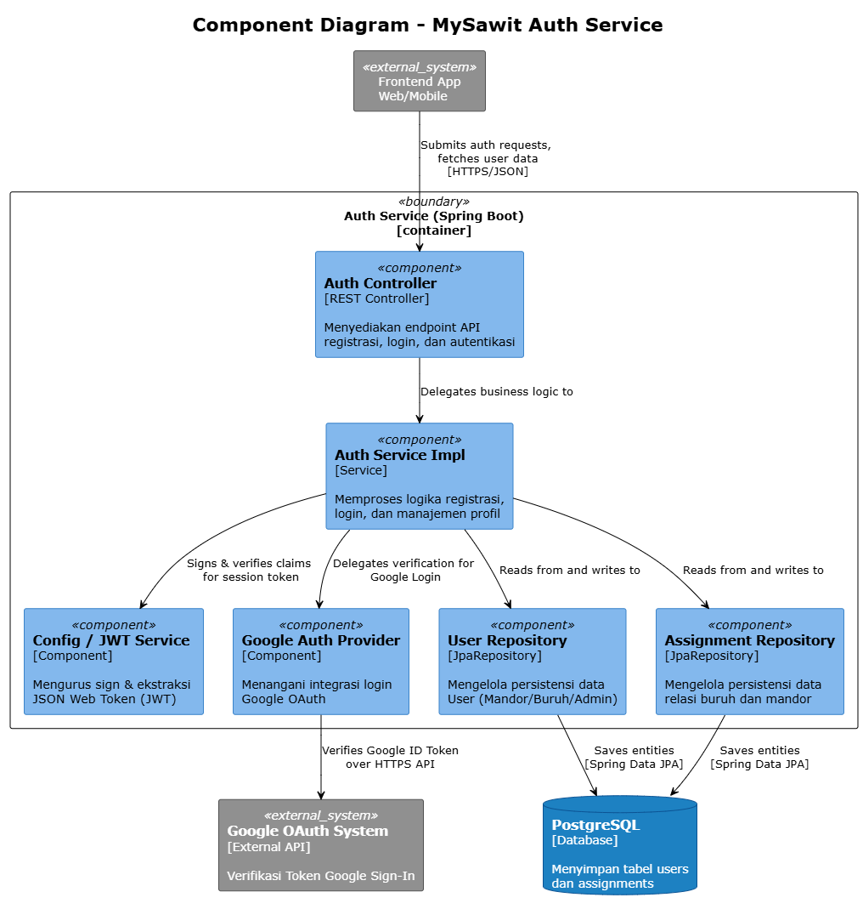

Diagram ini menunjukkan seluruh komponen dalam Auth Service beserta interaksinya dengan Frontend (Web/Mobile), Database (PostgreSQL Auth DB), dan External Service (Google OAuth). Diagram ini juga memvisualisasikan alur internal, seperti bagaimana controller mendelegasikan logika registrasi dan login ke service, hingga penyimpanan data pengguna dan relasi buruh-mandor.

### Code Diagrams

Diagram-diagram di bawah ini menunjukkan struktur class/interface di level kode dari modul Auth, dipisahkan berdasarkan fitur utama:

**1. Code Diagram 1 — Authentication Flow**: Menampilkan `AuthController`, interface `AuthService`, implementasinya `AuthServiceImpl`, `UserRepository`, `AuthProviderFactory`, dan `AuthTokenIssuer`. Diagram ini menunjukkan bagaimana proses registrasi dan login (baik password standar maupun via Google) dijalankan, divalidasi akunnya, hingga JWT diterbitkan.
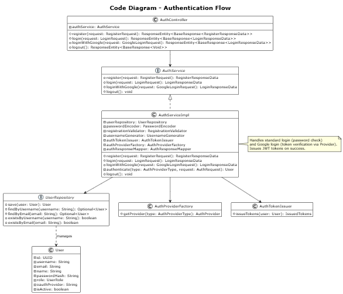

**2. Code Diagram 2 — Assignment Flow**: Menampilkan `AssignmentController`, interface `AssignmentService`, implementasinya `AssignmentServiceImpl`, `BuruhMandorAssignmentRepository`, dan `UserRepository`. Diagram ini menunjukkan alur di mana Admin mengatur, menugaskan (assign), mengalihkan (reassign), serta mencabut penugasan (unassign) relasi antara Buruh dan Mandor.
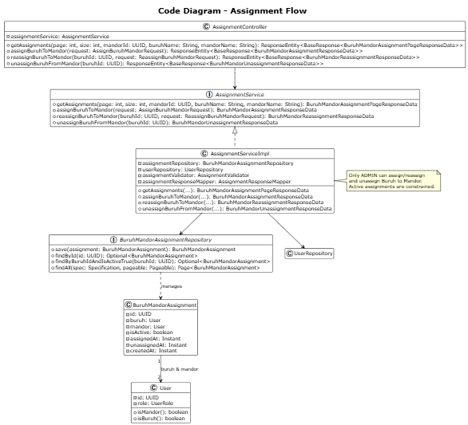

**3. Code Diagram 3 — User Management Flow**: Menampilkan `UserController`, interface `UserService`, implementasinya `UserServiceImpl`, `UserListAccessPolicy`, dan `UserRepository`. Diagram ini mendeskripsikan bagaimana profil pengguna diakses dan diedit (untuk pengguna sendiri), serta bagaimana Admin/Mandor memiliki akses tampilan list pengguna yang difilter dan divalidasi menurut *role-based access policy*.
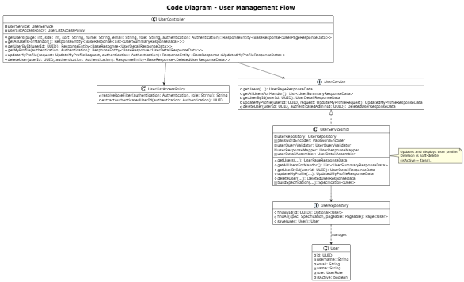

**4. Code Diagram 4 — Deleted User Tracking Flow**: Menampilkan `DeletedUserController`, interface `UserService`, implementasinya `UserServiceImpl`, dan `UserRepository`. Diagram ini memvisualisasikan bagaimana Admin dapat melacak dan melihat histori dan profil dari akun-akun yang telah dinonaktifkan (di-*soft-delete*).
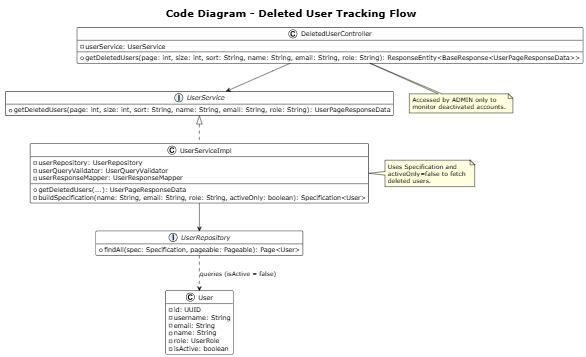

